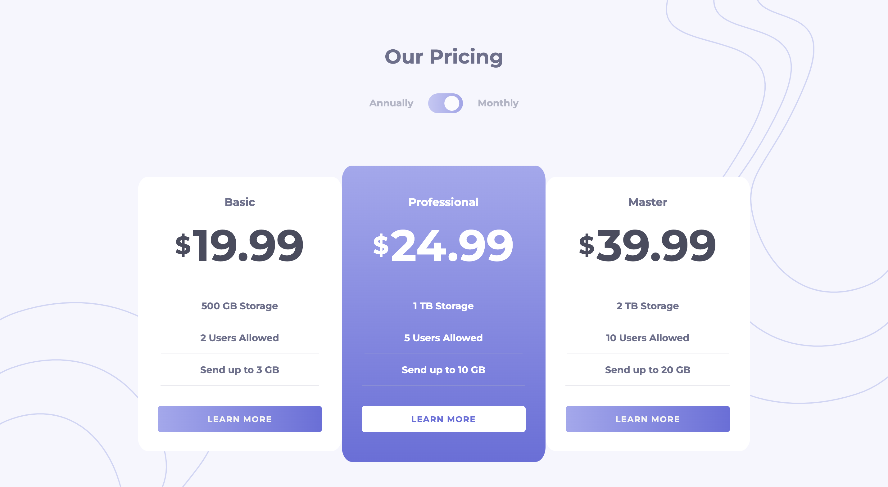
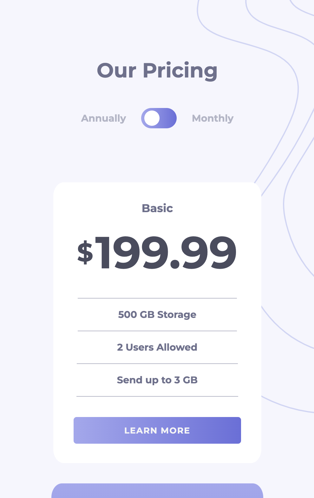
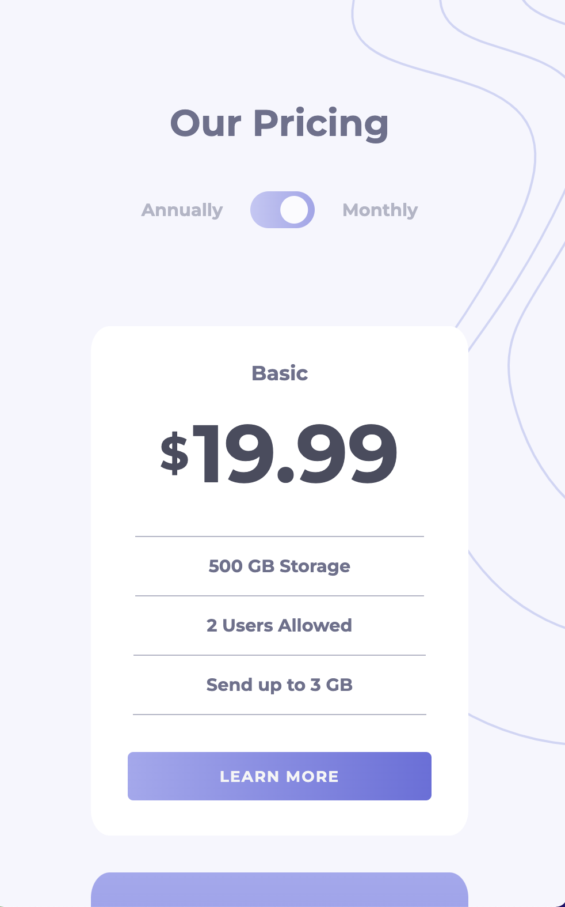

Live Url: https://kyle-barry-apps.github.io/pricing-structure-component

# Pricing component with toggle solution

This is a solution to the [Pricing component with toggle challenge on Frontend Mentor](https://www.frontendmentor.io/challenges/pricing-component-with-toggle-8vPwRMIC).

## Overview

Here we have a common view for pricing structures with a toggle between annual and monthly prices. I tried to keep the CSS and JS concise. I used a mobile-first workflow, using min-width as the media query.

### Screenshot

### Built with

- Semantic HTML5 markup
- CSS custom properties
- Flexbox
- Mobile-first workflow
